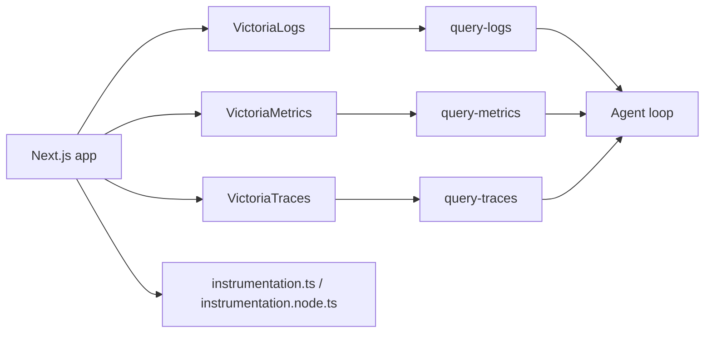

# Harness Legibility Demo Spec

## Purpose

This demo recreates the observability half of the architecture shown in OpenAI's "Giving Codex a full observability stack" diagram for a local Next.js worktree.

The goal is not to build a generic observability platform. The goal is to prove that a local agent can:

- run an isolated copy of the app;
- query logs, metrics, and traces for that isolated copy;
- evaluate runtime constraints such as "startup completes in under 800ms";
- re-run the workload and verify that the system is now clean.

## Primary goals

- Match the shape of the OpenAI diagram closely enough that the demo tells the same story.
- Keep everything runnable on a single local machine.
- Treat each worktree as an isolated stack with isolated data.
- Make logs queryable by an agent through a LogQL-like interface.
- Make metrics queryable by an agent through PromQL.
- Make traces queryable by an agent with a thin local query contract, even though the chosen backend does not expose native TraceQL.

## Non-goals

- Multi-user auth, tenancy, or production hardening.
- Long-term retention.
- A polished operator UI.
- Perfect parity with OpenAI's internal tooling.
- Full compatibility with every LogQL or TraceQL feature.

## Proposed topology

V1 should optimize for the simplest local stack that still preserves the OpenAI story. That means starting from the three Victoria services directly and deferring the shared ingress layer.

## Stack components

- `Next.js app`
  - produces structured logs, a Prometheus-compatible metrics endpoint, and OTLP traces.
- `VictoriaLogs`
  - stores logs for the current worktree stack.
- `VictoriaMetrics`
  - stores metrics and exposes a Prometheus-compatible query API.
- `VictoriaTraces`
  - stores traces and exposes LogsQL plus Jaeger query APIs.
- `query-*` wrappers
  - small local scripts or services that give the agent a stable contract.

## Worktree isolation contract

Every worktree stack gets:

- a unique `stack_id`;
- unique ports or a unique compose project name;
- a dedicated storage directory under the worktree;
- labels or fields attached to every signal:
  - `stack_id`
  - `worktree_id`
  - `service`
  - `git_ref` when available

The lifecycle contract is:

1. `stack up` starts app plus local observability services.
2. App emits only to the local services for that stack.
3. Agent queries only data labeled for that stack.
4. `stack down --purge` destroys containers/processes and removes data directories.

This is the mechanism that makes "ephemeral per worktree" real in the demo.

## Query contract

The agent should not talk to raw backend APIs directly in v1. It should use thin wrappers with a stable contract:

- `query-logs`
  - input: constrained LogQL-like query, time range, stack selector
  - output: normalized log rows
- `query-metrics`
  - input: PromQL, time range, step, stack selector
  - output: normalized metric series or scalar result
- `query-traces`
  - input: service, journey, duration filters, stack selector
  - output: normalized traces and spans

This keeps the agent contract stable even if the backend implementation needs to change.

## Important compatibility note

The OpenAI diagram uses the labels `LogQL API`, `PromQL API`, and `TraceQL API`.

For the chosen local stack:

- `VictoriaMetrics` maps cleanly to PromQL-compatible querying.
- `VictoriaLogs` uses `LogsQL`, not native Loki LogQL.
- `VictoriaTraces` uses `LogsQL` and Jaeger JSON APIs, not native TraceQL.

V1 should therefore present:

- a LogQL-like public query surface for logs, translated internally as needed;
- direct PromQL for metrics;
- a narrow trace query wrapper for traces.

This preserves the story of the OpenAI diagram without pretending the backing APIs are identical.

## Why V1 skips Vector

The OpenAI diagram includes `Vector` as a local fan-out layer. That is useful as a reference architecture, but it is not the best starting point for this demo.

For V1, the simpler and more reliable choice is:

- initialize `VictoriaLogs` from its own quick start;
- initialize `VictoriaMetrics` from its own quick start;
- initialize `VictoriaTraces` from its own quick start;
- connect the app to each backend directly.

This keeps the demo close to the OpenAI outcome while minimizing moving parts.

Vector can be introduced later as a Phase 4 refinement if we decide the demo specifically needs a single ingress tier.

## Demo use cases

The stack must make the following prompts tractable:

- "Ensure service startup completes in under 800ms."
- "No span in these four critical user journeys exceeds two seconds."
- "Find startup errors for this worktree."
- "Show the slowest request in the last run for this worktree."

## Proposed demo journeys

These are the canonical names for the four critical user journeys in v1:

- `home.initial_load`
- `demo.component_interaction`
- `diagnostics.view`
- `action.submit`

These names are normative in v1. If the UI flow changes later, the implementation should preserve these journey identifiers unless the spec is explicitly revised.

## V1 decisions

The following decisions are normative for v1 and are not left open:

- `Vector` is not part of v1.
- Logs use direct app-to-`VictoriaLogs` HTTP ingestion.
- Metrics use a Prometheus-compatible `/metrics` endpoint scraped directly by `VictoriaMetrics`.
- Traces export directly to `VictoriaTraces` via OTLP.
- `query-logs` exposes structured filter arguments, not a free-form LogQL parser.
- `query-traces` exposes structured filter arguments, not a free-form trace query language.
- Startup is represented as a dedicated trace rooted at `app.startup`.
- Startup duration is exposed as a gauge named `demo_app_startup_duration_ms`.
- Journey metrics are emitted directly by app code in v1 rather than derived from traces.

## Delivery phases

### Phase 1

- local stack bootstrap
- stack identity and teardown
- structured logs to `VictoriaLogs`
- minimal log querying

### Phase 2

- Prometheus-style metrics scraping into `VictoriaMetrics`
- PromQL query path
- startup and request metrics

### Phase 3

- OTLP traces from `instrumentation.ts`
- direct export to `VictoriaTraces`
- four named journeys
- span duration validation

### Phase 4

- optional `Vector` ingress layer
- optional convergence toward the full OpenAI diagram

## Known implementation risk

The main fidelity gap in V1 is that it omits `Vector`, which means the local stack does not yet have a single fan-out tier like the OpenAI diagram.

This is intentional. The demo prioritizes local reliability over diagram-level fidelity in its first implementation.

The public agent contract should therefore be designed so that introducing `Vector` later does not require changing the query surface.
